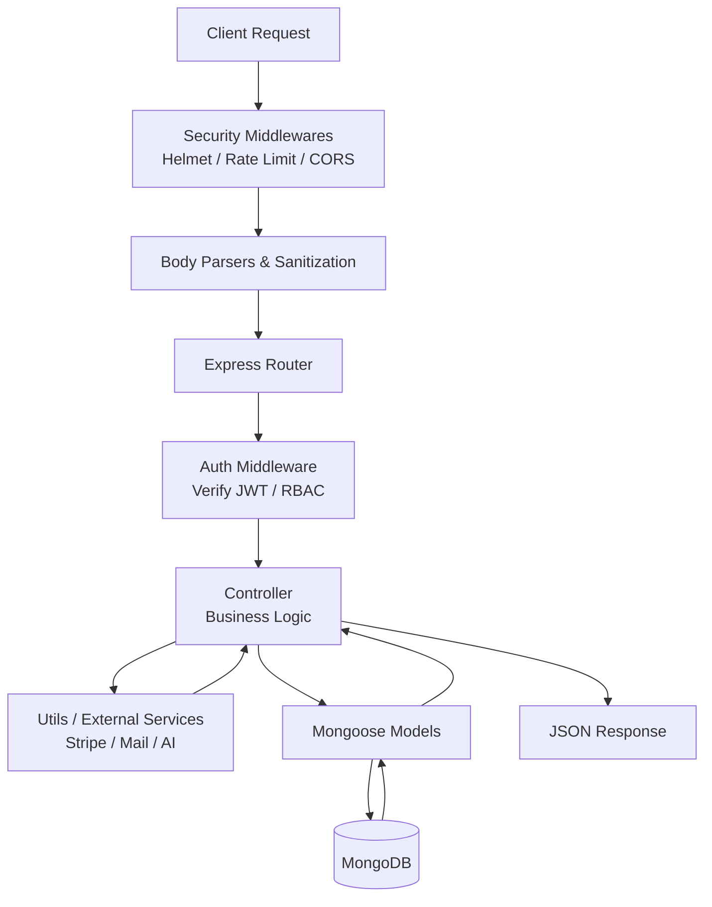
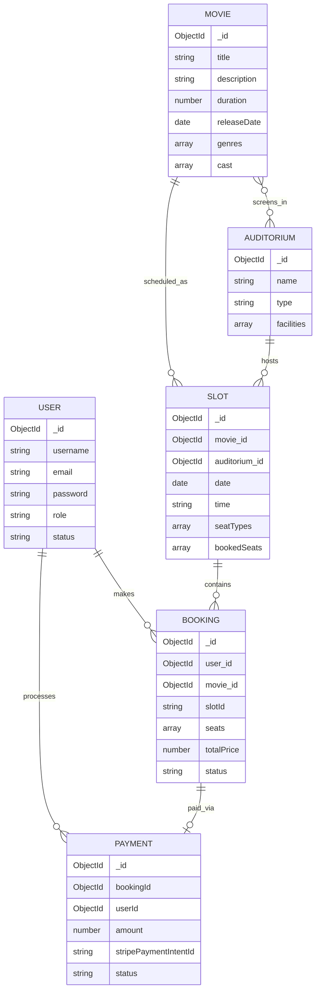
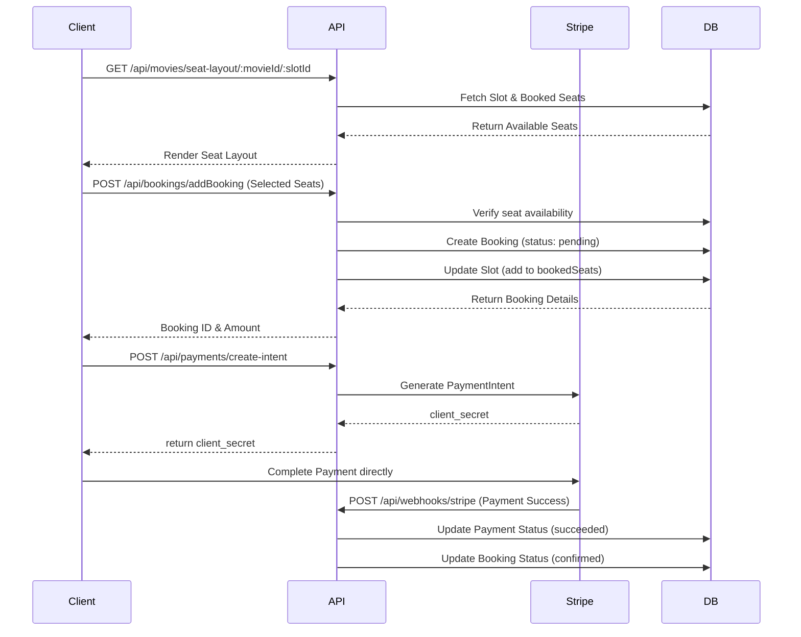
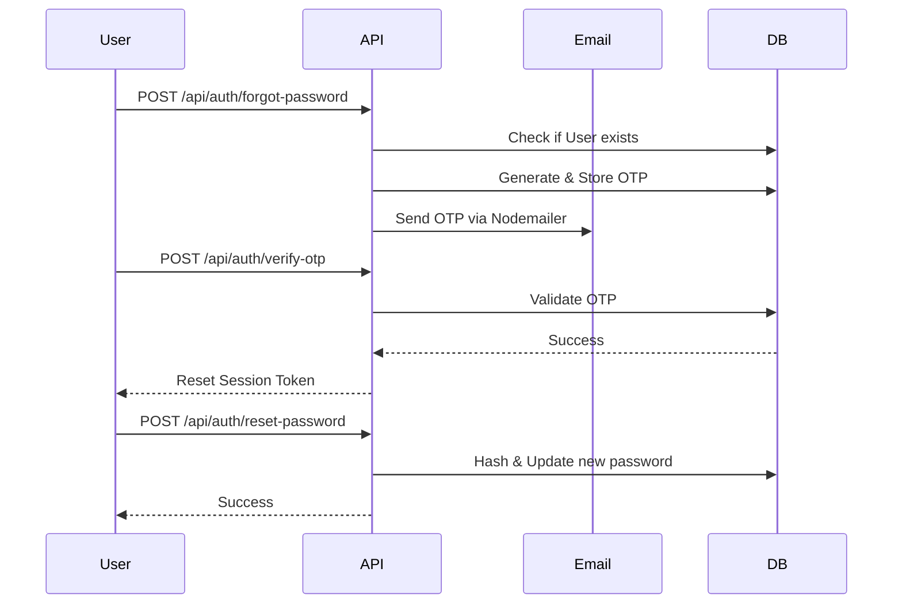

# 🎬 Cinema Booking System

> **A comprehensive cinema ticket booking system with an advanced admin dashboard**

[](https://nodejs.org/)
[](https://www.mongodb.com/)
[](https://expressjs.com/)
[](https://www.typescriptlang.org/)
[](https://stripe.com/)
[](https://jwt.io/)

## 1. About the Project

The Cinema Booking System API is a robust, scalable backend engineered to power a modern movie theater platform. It handles the complete lifecycle of cinema operations, from user authentication and dynamic movie cataloging to complex seat-level reservations and secure payment processing.

Designed for high performance and security, this project abstracts the complexities of concurrency in seat booking, payment fulfillment, and media management. Based on the current configurations (clean TypeScript setup, active migrations, and integration of Stripe/Cloudinary), the project appears to be a highly-developed MVP nearing production readiness.

## 2. Features

### Core Features
*   **Authentication & User Management:** JWT-based stateless authentication, role-based access control (Admin/User), and secure OTP-based password recovery via email.
*   **Movie Cataloging & Discovery:** Advanced querying capabilities for movies (by genre, release year, cast/crew, now showing, coming soon) with autocomplete search.
*   **Cinema & Showtime Management (Admin):** Create and manage auditoriums (Standard, Premium, IMAX, VIP), allocate movies to specific halls, and generate showtime slots with dynamic seat types and pricing.
*   **Concurrency-Safe Booking Engine:** Seat-level reservation system that tracks available/booked seats per slot and prevents double-booking. Includes a background cleanup job to release unpaid pending seats.
*   **Secure Payment Processing:** Integration with Stripe for handling Checkout Sessions, Payment Intents, refunds, and real-time payment confirmation via Webhooks.

### Secondary / Nice-to-Have Features
*   **AI Chatbot Integration:** Embedded Google Generative AI helper to assist users with queries.
*   **Media Management:** Direct integration with Cloudinary for handling and optimizing movie posters, banners, and user avatars.
*   **Admin Dashboard Stats:** Aggregated data endpoints for admins to track users, payments, and system health.

## 3. Tech Stack

### Backend
*   **Runtime:** Node.js (v24 types) with TypeScript (v5.9.3)
*   **Framework:** Express.js (v5.1.0)
*   **Database:** MongoDB
*   **ORM:** Mongoose (v9.0.0)
*   **Authentication:** `jsonwebtoken` (JWT), `bcrypt` (Password Hashing)
*   **File Uploads:** `multer`, `cloudinary`, `multer-storage-cloudinary`
*   **Payments:** `stripe` (v20.0.0)
*   **Email Services:** `nodemailer`
*   **Security:** `helmet`, `cors`, `express-rate-limit`, Custom XSS & NoSQL injection sanitizers
*   **AI Integration:** `@google/generative-ai`

### DevOps/Infra
*   **Development Tools:** `nodemon`, `tsx` for direct TypeScript execution.
*   **Build Tool:** `tsc` (TypeScript Compiler)

## 4. System Architecture

The backend follows a standard **Modular Monolith REST API** architecture.

### Layering Pattern
The application strictly follows a **Route → Middleware → Controller → Model** pattern.
*   **Routes:** Map HTTP endpoints to specific controller methods.
*   **Middlewares:** Handle cross-cutting concerns (Auth validation, Admin RBAC, File parsing, Input Validation).
*   **Controllers:** Act as "fat controllers", containing the core business logic, querying the models, and formulating HTTP responses.
*   **Models (Mongoose):** Define schemas, handle database constraints, and contain minor data-level virtuals/methods (e.g., checking if a movie is currently showing).
*   **Utils/Helpers:** Abstract 3rd-party service logic (`stripeService`, `emailService`, `cleanupService`).

### Request Lifecycle
`Client Request` → `Global Security Middleware (Rate Limits, Helmet, Sanitization)` → `Route Definition` → `Auth/Role Middleware (protect, adminOnly)` → `Controller Logic` → `Mongoose Model` → `MongoDB` → `JSON Response`



## 5. Database Schema & ERD

The database utilizes MongoDB. Below is the relational mapping of the collections based on the Mongoose Schemas:

*   **Users:** Stores credentials, roles (`admin`, `user`), status, and profile info.
*   **Movies:** Stores rich metadata, media (poster, gallery, trailers), cast arrays, and categorized arrays.
*   **Auditoriums:** Physical cinema halls with specific types (IMAX, VIP) and capacities.
*   **Slots:** The junction of a Movie, Auditorium, and Time. Holds the active state of seats (`bookedSeats`, `availableSeats`).
*   **Bookings:** Tracks user reservations, locking specific seats in a specific Slot. Has statuses (`pending`, `confirmed`, `cancelled`).
*   **Payments:** Records Stripe transactions, linked directly to a Booking and User.
*   **Genres:** Lookup table for movie categorization.



## 6. Key Flows

### 1. The Booking & Payment Flow
This is the most critical flow ensuring users can safely select seats, hold them, and pay without concurrency issues (double booking).



### 2. Password Reset Flow


## 7. API Documentation

### Auth & Users (`/api/auth`)
| Method | Endpoint | Auth | Description |
| :--- | :--- | :--- | :--- |
| POST | `/register` | Public | Register a new user account. |
| POST | `/login` | Public | Authenticate user and return JWT. |
| POST | `/logout` | Bearer | Clear active session/token. |
| GET | `/current-user` | Bearer | Get profile of logged-in user. |
| POST | `/forgot-password` | Public | Request an OTP to email for password reset. |
| POST | `/reset-password` | Public | Provide valid session to change password. |
| GET | `/users` | Admin | Retrieve all users. |
| PUT | `/users/:id/role` | Admin | Escalate or demote user roles. |

### Movies (`/api/movies`)
| Method | Endpoint | Auth | Description |
| :--- | :--- | :--- | :--- |
| GET | `/allMovies` | Public | Get paginated list of movies. |
| GET | `/getSpecificMovie/:id` | Public | Get detailed metadata for a movie. |
| GET | `/search` | Public | Advanced search (queries, genres, years). |
| GET | `/seat-layout/:movieId/:slotId` | Public | Get the layout and availability of seats for a slot. |
| POST | `/addMovie` | Admin | Create a new movie record (supports Multer image uploads). |
| PUT | `/updateMovie/:id` | Admin | Edit an existing movie. |

### Bookings (`/api/bookings`)
| Method | Endpoint | Auth | Description |
| :--- | :--- | :--- | :--- |
| POST | `/addBooking` | Bearer | Create a new pending booking with selected seats. |
| GET | `/userBookings/:userId` | Bearer | Get all bookings for a user (IDOR protected). |
| PUT | `/cancelBookings/:bookingId` | Bearer | Cancel a pending/confirmed booking. |
| GET | `/allBookings` | Admin | View all bookings across the system. |

### Payments (`/api/payments` & Webhooks)
| Method | Endpoint | Auth | Description |
| :--- | :--- | :--- | :--- |
| POST | `/create-intent` | Bearer | Generate a Stripe PaymentIntent for a pending booking. |
| POST | `/refund` | Admin | Process a refund for a cancelled ticket. |
| POST | `/api/webhooks/stripe` | Stripe | Raw body endpoint for Stripe to asynchronously confirm payments. |

## 8. Key Technical Decisions

*   **Express 5.x Adoption:** The project utilizes Express v5. Because Express 5 makes `req.query` getter-only, traditional NoSQL injection middleware (`express-mongo-sanitize`) failed. The developers wisely implemented a custom sanitization middleware that targets `req.body` directly, demonstrating good adaptation to modern framework constraints.
*   **Stripe Webhook Placement:** The Stripe webhook route (`/api/webhooks`) is explicitly declared *before* the global `express.json()` parser. This is a critical architectural necessity, as Stripe requires the raw, unparsed buffer to verify webhook cryptographic signatures.
*   **Background Cleanup Jobs:** Instead of relying strictly on client-side timeouts, a background script (`cleanupService.ts`) is initialized on server start. It periodically sweeps the database for `pending` bookings that have exceeded their time limit, unblocking seats for other users.
*   **Security Layers:** The API is heavily fortified. It implements generic Rate Limiting (`express-rate-limit`), with isolated, stricter limits applied specifically to sensitive endpoints like `/login` and `/forgot-password` to prevent brute-force and credential stuffing attacks. `helmet` is also configured for secure HTTP headers.

## 🚀 Quick Start

### Prerequisites
- Node.js 18+
- MongoDB 7+
- Git

### Installation

```bash
# Clone the repository
git clone https://github.com/your-username/cinema-booking-system.git
cd cinema-booking-system/backend

# Install dependencies
npm install

# Setup environment variables
cp .env.example .env
```

### Environment Variables Setup

```env
# Database
MONGODB_URI=mongodb://localhost:27017/cinema-booking

# JWT
JWT_SECRET=your-super-secret-jwt-key
JWT_EXPIRES_IN=7d

# Stripe
STRIPE_SECRET_KEY=sk_test_your_stripe_secret_key
STRIPE_WEBHOOK_SECRET=whsec_your_webhook_secret

# Email (Gmail)
GMAIL_USER=your-email@gmail.com
GMAIL_APP_PASSWORD=your-gmail-app-password
EMAIL_FROM=Cinema Booking <your-email@gmail.com>

# Server
PORT=5000
NODE_ENV=development
FRONTEND_URL=http://localhost:3000

# Rate Limiting
RATE_LIMIT_WINDOW_MS=900000
RATE_LIMIT_MAX=300
LOGIN_RATE_LIMIT_WINDOW_MS=900000
LOGIN_RATE_LIMIT_MAX=10
FORGOT_RATE_LIMIT_WINDOW_MS=3600000
FORGOT_RATE_LIMIT_MAX=5
```

### Running the Project

```bash
# Development
npm run dev

# Production
npm run build
npm start
```

---

**Built with ❤️ for movie lovers everywhere** 🎬✨
